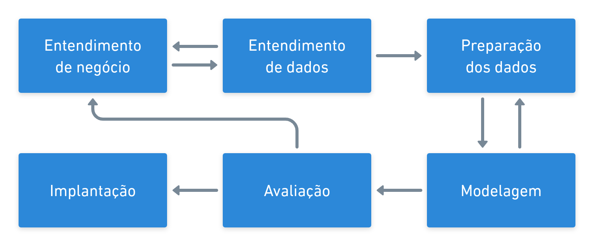
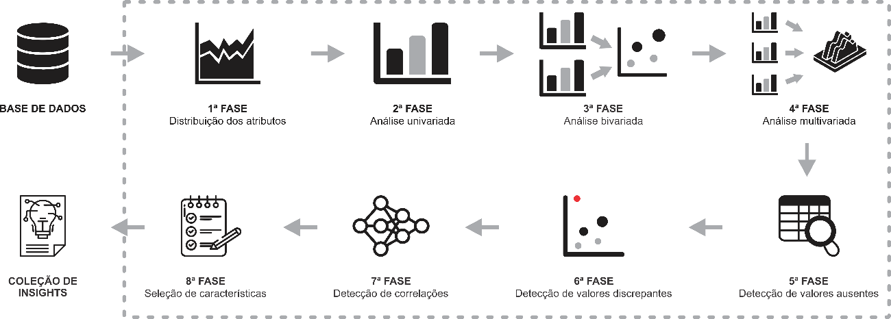

# Metodologia

O projeto será desenvolvido seguindo a Metodologia de ciência de dados da CGGD – Coordenação-Geral de Governança de Dados.

## CRISP-DM

Cross-industry standard process for data mining (Processo padrão inter-industriais para mineração de dados, ou **Crisp-DM**) é uma metodologia, desenvolvida em 1999 para padronizar processos industriais de mineração de dados, que fornece uma abordagem clara e bem estruturada para processos que envolvem projetos de ciência de dados em geral (mineração, análise, aprendizado de máquina, etc.). 

Mesmo que não mencionada explicitamente, a maioria das equipes de ciência de dados utilizam alguma metodologia similar a CRISP-DM ou combinação dela com outras metodologias de desenvolvimento de software. 

### FASES DA CRISP-DM 

A CRISP -DM é composta por um conjunto de passos que devem ser seguidos no ciclo de vida de um projeto de ciência de dados. Tais passos (ou etapas) ajudam a planejar, organizar e implementar o projeto de ciência de dados. Além disso, cada um desses passos ajuda a encontrar respostas das seguintes questões: 
- Entendimento do negócio: o que o negócio precisa? 
- Entendimento dos dados: que dados temos? quais dados precisamos? os dados estão "limpos"? 
- Preparação dos dados: como organizamos os dados para a etapa de modelagem? 
- Modelagem: quais técnicas de modelagem podemos aplicar ao nosso problema? E quais devemos utilizar? 
- Avaliação: qual modelo atende melhor aos objetivos de negócios? 
- Implantação: como as partes interessadas acessem os resultados do projeto? 

Uma visão geral da CRISP-DM é apresentada na Figura abaixo.

#### ENTENDIMENTO DE NEGÓCIO 

A etapa de entendimento de negócio se destina a compreensão dos objetivos e requisitos do projeto. Essa etapa pode ser dividida em quatro tarefas, a saber: 

- Determinar os objetivos de negócio: nessa etapa a equipe deve "entender completamente, de uma perspectiva de negócios, o que o cliente realmente deseja realizar" e, em seguida, definir os critérios de sucesso do negócio. 
- Avaliar a situação: após definir quais os critérios de sucesso, deve-se determinar a disponibilidade de recursos, os requisitos do projeto, avaliar os riscos e contingências e conduzir uma análise de custo-benefício. 
- Determinar as metas de mineração de dados: além de definir os objetivos de negócios, a equipe também deve definir o que é sucesso de uma perspectiva técnica de mineração de dados. 
- Produzir o plano do projeto: selecionar tecnologias e ferramentas e definir planos detalhados para cada fase do projeto. 

Embora muitas equipes passem rapidamente por essa fase, estabelecer um forte entendimento de negócios é absolutamente essencial.  Como você deve ter notado, além da terceira tarefa, as outras três tarefas nesta fase são atividades básicas de gerenciamento de projetos que são universais para a maioria dos projetos.

#### ENTENDIMENTO DOS DADOS 

Adicionalmente a etapa de entendimento de negócio, a etapa de entendimento dos dados direciona o foco para identificar, coletar e analisar os conjuntos de dados que podem ajudá-lo a cumprir os objetivos do projeto. Esta fase também possui quatro tarefas: 

- Coletar os dados iniciais: adquirir os dados necessários e (se necessário) carregá-los em ferramentas de análise. 
- Descrever os dados: examinar os dados e documentar suas propriedades superficiais, como formato de dados, número de registros ou identidades de variáveis. 
- Explorar os dados: realizar uma análise mais aprofundada nos dados. Consultar, visualizar e identificar relações entre dados e variáveis. 
- Verificar a qualidade dos dados: realizar análises a respeito da qualidade dos dados: o quão limpos são? Também é necessário documentar qualquer tipo de problema de qualidade dos dados. 

#### PREPARAÇÃO DOS DADOS 

Esta etapa é necessária para efetuar a preparação dos conjuntos de dados que serão utilizados na etapa de modelagem. É uma das etapas mais importantes, pois ela afeta diretamente a possibilidade de bons resultados na etapa de modelagem. Ela geralmente é composta por cinco tarefas: 

- Selecionar os dados: determinar quais conjuntos de dados serão utilizados e documentar os motivos para inclusão ou exclusão. 
- Limpar dados: frequentemente, essa é a tarefa mais demorada. Uma prática comum durante essa tarefa é corrigir, imputar ou remover valores erroneamente inseridos nos conjuntos de dados. 
- Construir dados: derivar novos atributos que serão úteis. Por exemplo, derivar o índice de massa corporal de alguém a partir dos campos de altura e peso. 
- Integrar dados: criar novos conjuntos de dados combinando dados de várias fontes. 
- Formatar dados: Formatar novamente os dados conforme as necessidades dos modelos. 

Por exemplo, você pode converter valores de string que armazenam números em valores numéricos para que possa realizar operações matemáticas. 

#### MODELAGEM 
Nesta etapa as equipes provavelmente construirão e avaliaram vários modelos com base em várias técnicas de modelagem diferentes. Esta fase tem as seguintes tarefas:

- Selecionar as técnicas de modelagem: determinar quais métodos/modelos serão utilizados (por exemplo, regressão, redes neurais artificiais). A escolha do modelo depende do tipo de problema que se está querendo resolver e da aplicação. 
- Gerar desenho do experimento: é necessário criar um experimento para que os modelos selecionados possam ser comparados, utilizando os conjuntos de dados disponíveis. Geralmente são utilizados experimentos envolvendo validação cruzada e simulação de Monte Carlo. Tais experimentos geralmente têm como resultado métricas de taxa de acerto ou erro dos modelos mediante os conjuntos de dados. 
- Construir dos modelos: nessa tarefa são realizados os treinamentos dos modelos de acordo com o experimento desenhado. 
- Avaliar modelos: nessa tarefa os modelos são comparados de acordo com as métricas capturadas e assim, um deles (ou vários) são escolhidos para serem utilizados na próxima etapa. 

Geralmente as tarefas são repetidas até que a equipe acredite fortemente que encontrou o melhor modelo (ou os melhores), ou um modelo que seja suficientemente bom para a aplicação. 

#### AVALIAÇÃO
Enquanto que a tarefa de "avaliar modelos" na fase de Modelagem se concentra na
avaliação do técnica do modelo, a fase de Avaliação analisa mais amplamente qual modelo
atende melhor ao negócio e o que fazer a seguir. A avaliação aqui destina-se ao projeto
como um todo. Esta fase tem três tarefas:

- Avaliar os resultados: os modelos atendem aos critérios de sucesso do negócio? Qual (ou quais) devem ser aprovados para o negócio?
- Revisar o processo: análise do trabalho realizado. Alguma coisa foi esquecida? Todas as etapas foram executadas corretamente? Nesta tarefa a equipe deve resumir as descobertas e corrigir o que for necessário.
- Determinar as próximas etapas: Com base nas três tarefas anteriores, a equipe deve determinar se deseja prosseguir com a implantação, iterar mais ou iniciar novos projetos.

#### IMPLANTAÇÃO 

Um modelo não é particularmente útil, a menos que o cliente possa acessar seus resultados, seja por meio de relatórios ou mesmo através de um serviço criado para utilização de tais modelos. A complexidade desta fase varia amplamente. Esta fase final e tem quatro tarefas: 

- Planejar a implantação: desenvolver e documentar um plano de implantação do modelo. 
- Planejar o monitoramento e manutenção dos modelos: desenvolver um plano completo de monitoramento e manutenção para evitar problemas durante a fase operacional (ou fase pós-projeto) de um modelo. 
- Produzir o relatório final: a equipe deve documentar um resumo do projeto, que pode incluir uma apresentação final dos resultados. 
- Revisar o projeto: é necessário conduzir uma retrospectiva do projeto sobre o que deu certo, o que poderia ter sido melhor e como melhorar no futuro. 

O trabalho pode não terminar nessa etapa. Como estrutura de projeto, o Crisp-DM não descreve o que fazer após o projeto. Mas se o modelo for para produção, certifique-se de mantê-lo em produção. O monitoramento constante e o ajuste ocasional do modelo são frequentemente necessários.

## Análise Exploratória

Nessa fase será realizado uma análise exploratória dos dados seguindo as etapas apresentadas a seguir:

Realizar análise sobre a distribuição de cada uma das características mapeando possibilidades:
 
1.  A análise estatística univariada analisa a distribuição e dispersão dos dados: a análise da distribuição de frequências e a análise das medidas de localização, dispersão, assimetria e curtose dos dados. 
2.  Na avaliação estatística da causalidade, convencionou-se descrever essas análises bivariadas como formas de investigar se a variação de uma característica pode ser explicada pela variação de outra medida. 
3.  Análise multivariada é uma ferramenta que encontra padrões e relações entre várias variáveis, permitindo prever efeitos e mudanças que uma variável terá sobre a outra. 
4.  Detecção de valores ausentes é uma tarefa comum na área de ciência de dados para mensurar os impactos dessa ausência no conjunto de dados em estudo. 
5.  A detecção de outliers consiste na identificação de padrões em dados com um comportamento diferente do esperado. Estes padrões são muitas vezes referidos como anomalias. 
6.  Em probabilidade e estatística, correlação, dependência ou associação é qualquer relação estatística entre duas ou mais variáveis. 
7.  Os métodos de seleção de características têm a missão de encontrar uma combinação adequada de características relevantes para o aprendizado de um conceito.

## Tecnologia e Ferramentas

No que tange ao campo ciência de dados dentro de projetos que envolvem essa área, almeja-se extrair insights significativos sobre os dados do projeto, para os interessados das áreas de negócio, utilizando-se uma abordagem multidisciplinar que combina princípios e práticas das áreas de matemática, estatística, inteligência artificial e engenharia da computação.

|Ferramenta            | Descrição                            |
|:---------------------|:--------------------------------     |
|:simple-github: Gitlab|Gerenciar o controle de versões.      |
|:simple-poetry: Poetry|Para gerenciamento de libs do projeto.|
|:simple-python: ~pyenv|Controle de versões do python.        |
|:simple-jupyter:Jupyter notebook|Ambiente para escrever os scripts necessários.|
|:fontawesome-solid-list-check: Python|Realizar as atividades de ETL, análise exploratória dos dados e construção de modelos preditivos, bem como atividades relacionadas.|
|:material-bookshelf: Bibliotecas|Pandas, numpy Scrapy, Selenium, requests, scikit-learn, Matplotlib, Seaborn, Plotly, Folium.|
